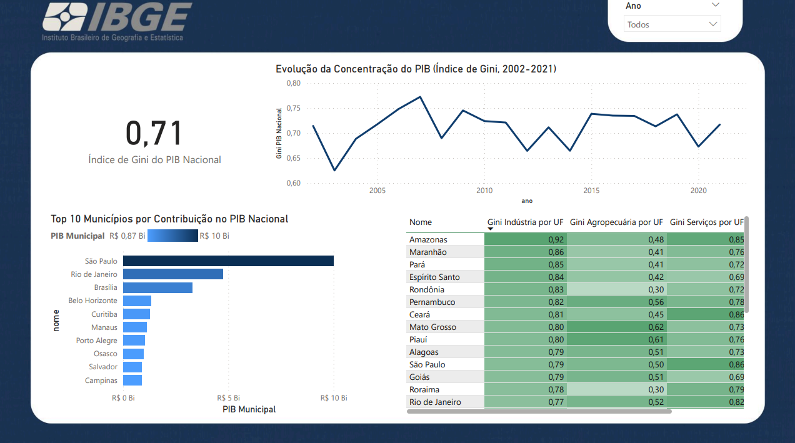

# Projeto Power BI: Análise da Economia Brasileira (PIB e Desigualdade)

## Visão Geral do Projeto

Este projeto de Power BI oferece uma análise aprofundada da economia brasileira, focando no Produto Interno Bruto (PIB) em níveis nacional, setorial e municipal, além de explorar a concentração de riqueza e a desigualdade através do Índice de Gini. O objetivo principal é fornecer insights claros e acionáveis sobre a estrutura econômica do país e suas dinâmicas ao longo do tempo.

O projeto é dividido em três dashboards interativos, cada um com um foco específico, utilizando princípios de *Storytelling with Data* (SWD) para garantir a clareza e o impacto da comunicação dos dados.

## Dados Utilizados

Os dados foram extraídos de fontes públicas e confiáveis, principalmente do **Instituto Brasileiro de Geografia e Estatística (IBGE)**, incluindo informações sobre:
- PIB Nacional por Unidade da Federação (UF) e Município.
- Valor Adicionado (VA) por setor econômico (Agropecuária, Indústria, Serviços, Administração Pública).
- Índice de Gini do PIB.
- Tabelas de diretórios para UFs e Municípios (nomes, regiões).

## Metodologias e Habilidades Aplicadas

Este projeto demonstra proficiência em diversas áreas do Power BI e análise de dados:

1.  **Modelagem de Dados Robusta:**
    * Criação de um modelo de dados estrela (Star Schema) com tabelas de fatos (PIB, Gini) e tabelas de dimensão (Diretórios de UF, Municípios, Calendário).
    * Gerenciamento de relacionamentos eficientes entre as tabelas.

2.  **DAX (Data Analysis Expressions) Avançado:**
    * **Medidas de Participação:** Cálculo da porcentagem do PIB de UFs e setores em relação ao total nacional.
    * **Análise Temporal (Time Intelligence):** Medidas de `Crescimento Anual (%)` para comparar o PIB de um ano com o ano anterior, utilizando funções como `SAMEPERIODLASTYEAR`.
    * **Controle de Contexto:** Uso de `CALCULATE` e `ALL` para manipular filtros e obter KPIs nacionais independentes de seleções.
    * **Medidas Dinâmicas (SWITCH):** Criação de um Slicer de setor que altera dinamicamente o ranking de participação.
    * **Correção de Escala:** Ajuste da escala do Índice de Gini (divisão por 1.000.000) para garantir a precisão e credibilidade científica.

3.  **Visualização de Dados e Storytelling (Princípios SWD):**
    * **Clareza e Foco:** Design centrado na mensagem, utilizando títulos conclusivos e remoção de "clutter" (informações desnecessárias).
    * **Uso Estratégico da Cor:** Aplicação de formatação condicional (verde/vermelho para crescimento/retração, mapas de calor para Gini) para guiar o olhar do usuário para insights importantes.
    * **Consistência Visual:** Aplicação de um tema personalizado (fundo escuro, fontes claras, bordas arredondadas) para uma experiência de usuário coesa e profissional.
    * **Dashboards Interativos:** Utilização de Slicers e Drill-down para permitir que o usuário explore os dados.

4.  **Otimização de Desempenho:**
    * Medidas DAX otimizadas para um carregamento rápido dos visuais.

## Dashboards do Projeto

### 1. PIB Brasil: Panorama por UF

**Objetivo:** Oferecer uma visão geral do PIB brasileiro, destacando a participação e o crescimento econômico de cada Unidade da Federação.
**Principais Insights:** Identificação das UFs com maior contribuição para o PIB nacional e aquelas com maior/menor crescimento anual.

### 2. Estrutura Setorial por UF

**Objetivo:** Analisar a composição setorial do Valor Adicionado (VA) em cada UF, mostrando quais setores impulsionam a economia local.
**Principais Insights:** Comparação da importância da Agropecuária, Indústria, Serviços e Administração Pública por estado, com ranking dinâmico.

### 3. Concentração da Riqueza: Desigualdade e Poder Local

**Objetivo:** Avaliar o nível de desigualdade e a concentração de riqueza no Brasil, com foco no Índice de Gini e nos municípios de maior PIB.
**Principais Insights:** Evolução histórica do Gini, distribuição da desigualdade por setores nas UFs e ranking dos municípios mais ricos do país.

---

**Autor:** [linkedin.com/in/lucasbomfim10/]

**Contato:** [Lucadez01@gmail.com]

---
